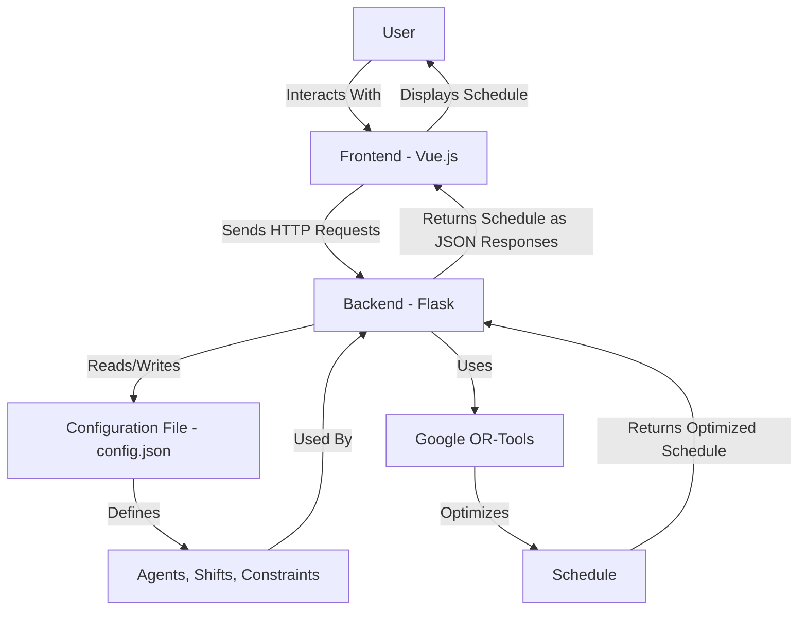

# Project Architecture

## HIGH LEVEL UNDERSTANDING

The **Schedule Optimization Project** is a tool designed to generate optimized work schedules for agents, considering constraints like availability, preferences, and training days. It consists of a **Flask-based backend** for scheduling logic and a **Vue.js-powered frontend** for user interaction. The backend communicates with the frontend via REST APIs, exchanging data such as agent schedules and configuration parameters.

### Architecture Diagram



### TECHNOLOGY STACK

- **Frontend:** Vue.js, JavaScript, HTML, CSS
- **Backend:** Flask, Python
- **Optimization Library:** Google OR-Tools
- **Configuration:** JSON
- **Build Tools:** Node.js, npm
- **Testing:** Pytest (backend), Jest (frontend)

### DESIGN DECISIONS (no order of importance)

- **Separation of Concerns:** The project separates the frontend and backend, allowing independent development and testing.
- **RESTful API:** The backend exposes REST APIs for communication, ensuring a clean interface between the frontend and backend.
- **Configurable Design:** The use of config.json allows users to customize agent preferences, vacations, and constraints without modifying the code.
- **Vue.js for Interactivity:** The frontend leverages Vue.js for dynamic and reactive user interfaces.
- **Google OR-Tools:** The backend uses OR-Tools for efficient constraint-based scheduling.

### GETTING STARTED

Prerequisites

- Python 3.10+
- Node.js and npm
- Flask

Steps

1. Clone the repository:

    ```bash
    git clone https://github.com/Vhivi/ScheduleOptimization.git
    cd ScheduleOptimization
    ```

2. Configure the application:

    - Edit `backend/config.json` to define agents, shifts, and constraints.

3. Start the backend server:

    ```bash
    cd backend
    pip install -r requirements.txt
    python app.py
    ```

4. Start the frontend server:

    ```bash
    cd frontend
    npm install
    npm run serve
    ```

5. Access the application at <http://localhost:8080>.

### OVERVIEW OF KEY COMPONENTS

The project is divided into two main components: **Frontend** and **Backend**.

#### Frontend

- **Main Entry Point:** `frontend/src/main.js`
  - Initializes the Vue.js application and mounts it to the DOM.

##### App.vue

- **Purpose:** Main application component that manages user input and displays schedules.
- **Key Features:** Reactive data binding, API calls to the backend.

##### PlanningTable.vue

- **Purpose:** Displays the generated schedule in a tabular format.
- **Key Features:** Dynamic rendering of schedules, color-coded cells for vacations.

#### Backend

- **Main Entry Point:** `backend/app.py`
  - Contains the Flask application and API endpoints.

##### Flask Application

- **Purpose:** Handles API requests and communicates with the optimization engine.
- **Key Features:** RESTful API design, JSON-based communication.

##### Google OR-Tools Integration

- **Purpose:** Performs constraint-based scheduling.
- **Key Features:** Efficient optimization algorithms.

### CODE MAP

#### Directory Structure

```plaintext
backend/
│   ├── app.py                # Backend entry point
│   ├── config.json           # Configuration file
│   └── tests/                # Backend unit tests
│
frontend/
    ├── src/                  # Frontend source code
    │   ├── main.js           # Frontend entry point
    │   ├── App.vue           # Main frontend component
    │   └── PlanningTable.vue # Component displaying the schedule
    └── tests/                # Frontend unit tests
```

#### API Overview

##### POST /generate-planning

- **Description**: Generates a schedule based on the provided time period.
- **Request Body**: A JSON object specifying the time period for which the schedule should be generated.
- **Response**: Returns the generated schedule in JSON format.

##### POST /previous-week-schedule

- **Description**: Retrieves the schedule for the previous week.
- **Request Body**: A JSON object specifying the start date of the schedule to be generated to retrieve the previous 7 days.
- **Response**: Returns a JSON object containing the previous week's schedule.

### ADDITIONAL NOTES

**Error Handling:** The backend handles errors related to user data (ex. invalid constraints) and returns clear error messages to the frontend (we try, at least).
**Scalability:** Although designed for medium-sized teams, the project can be extended to handle more complex schedules by adjusting constraints and optimizing algorithms.
**Testing:**

- **Backend :** Unit tests for the API and optimization algorithms are in backend/tests/.
- **Frontend :** Tests for Vue.js components are in frontend/tests/.
